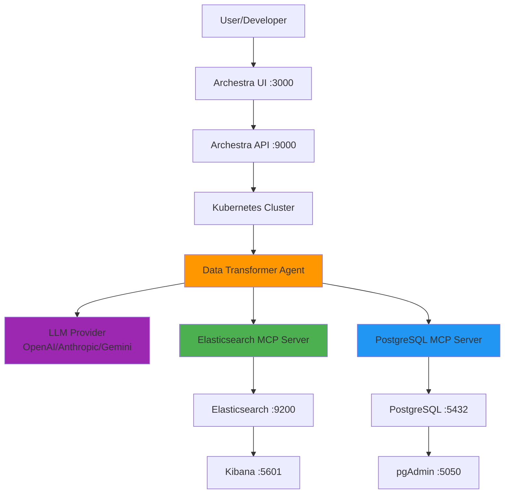
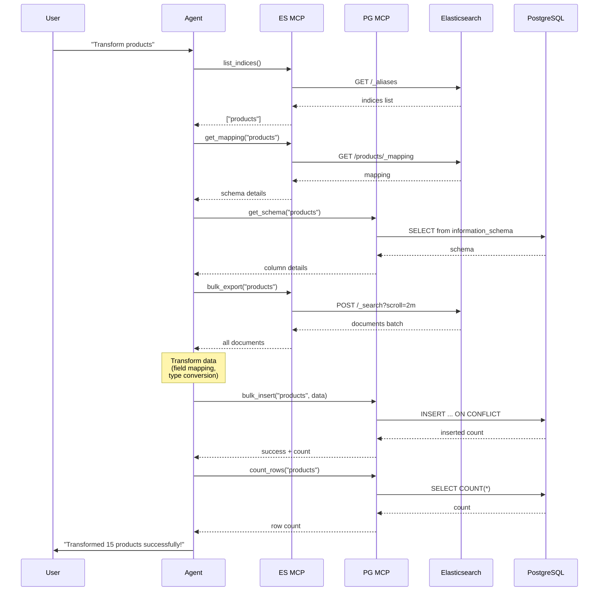

# Architecture Documentation

## System Overview

This project implements an AI-powered ETL (Extract, Transform, Load) pipeline using Archestra.ai as the orchestration platform. The system leverages the Model Context Protocol (MCP) to provide the AI agent with standardized access to both Elasticsearch and PostgreSQL databases.

## Architecture Diagram



## Component Details

### 1. Archestra.ai Platform

**Purpose**: Central orchestration and agent runtime platform

**Key Features**:
- Agent lifecycle management
- MCP server registry and deployment
- Built-in Kubernetes cluster for MCP servers
- Web UI for agent interaction
- REST API for programmatic access
- MCP Gateway for external integrations

**Technology**:
- Docker container with embedded K8s (k3s)
- Internal PostgreSQL for metadata
- Node.js/Go backend (proprietary)

### 2. Data Transformer Agent

**Purpose**: Intelligent orchestrator that performs the ETL workflow

**Capabilities**:
- Natural language understanding of transformation requests
- Dynamic schema discovery
- Intelligent field mapping
- Data type conversion
- Error handling and recovery
- Progress reporting

**Decision-Making Process**:
1. **Parse user intent** - Understand what transformation is needed
2. **Discovery** - Use MCP tools to explore source and target schemas
3. **Plan** - Decide on extraction method, transformations, and load strategy
4. **Execute** - Call MCP tools in sequence to perform ETL
5. **Verify** - Validate results and report to user

**Configuration**:
- Model: GPT-4 recommended (or equivalent)
- Temperature: 0.1 (low for consistency)
- Max tokens: 4000
- Enabled tools: All from both MCP servers

### 3. Elasticsearch MCP Server

**Purpose**: Provide standardized access to Elasticsearch for the agent

**Architecture**:
```
┌─────────────────────────────────┐
│     MCP Server (Python)         │
│  ┌──────────────────────────┐  │
│  │  MCP Protocol Handler    │  │
│  └──────────┬───────────────┘  │
│             │                   │
│  ┌──────────▼───────────────┐  │
│  │  Elasticsearch Client    │  │
│  │  (elasticsearch-py)      │  │
│  └──────────┬───────────────┘  │
└─────────────┼───────────────────┘
              │
              ▼
      Elasticsearch API
```

**Tools Provided**:
- `search_documents` - DSL query execution
- `get_document` - Direct document ictivity retrieval
- `list_indices` - Index discovery
- `get_mapping` - Schema inspection
- `bulk_export` - Scroll API wrapper for batch export
- `count_documents` - Document counting

**Implementation Details**:
- Language: Python 3.11
- Libraries: `elasticsearch>=8.11.0`, `mcp>=0.9.0`
- I/O: stdio (standard input/output for MCP communication)
- Deployment: Kubernetes pod in Archestra cluster

### 4. PostgreSQL MCP Server

**Purpose**: Provide standardized access to PostgreSQL for the agent

**Architecture**:
```
┌─────────────────────────────────┐
│     MCP Server (Python)         │
│  ┌──────────────────────────┐  │
│  │  MCP Protocol Handler    │  │
│  └──────────┬───────────────┘  │
│             │                   │
│  ┌──────────▼───────────────┐  │
│  │  PostgreSQL Client       │  │
│  │  (psycopg2)              │  │
│  └──────────┬───────────────┘  │
└─────────────┼───────────────────┘
              │
              ▼
      PostgreSQL Protocol
```

**Tools Provided**:
- `execute_query` - Safe SELECT query execution
- `insert_data` - Single row insert
- `bulk_insert` - Batch insert with UPSERT support
- `get_schema` - Table schema inspection
- `list_tables` - Table discovery
- `create_table` - Table creation (for setup)
- `count_rows` - Row counting with WHERE support

**Implementation Details**:
- Language: Python 3.11
- Libraries: `psycopg2-binary>=2.9.9`, `mcp>=0.9.0`
- I/O: stdio (standard input/output for MCP communication)
- Deployment: Kubernetes pod in Archestra cluster
- Connection pooling: Per-request connections (stateless)

### 5. Databases

**Elasticsearch**:
- Version: 8.11.3
- Mode: Single-node (development)
- Index: `products` with custom mapping
- Documents: 15 sample products
- Features: Full-text search, aggregations

**PostgreSQL**:
- Version: 16 Alpine
- Database: `transformation_db`
- Table: `products` with relational schema
- Features: ACID compliance, constraints, indexes

**Schema Mapping**:

| Elasticsearch | Type | PostgreSQL | Type |
|---------------|------|------------|------|
| id | keyword | id | VARCHAR(50) PK |
| name | text | name | VARCHAR(255) |
| category | keyword | category | VARCHAR(100) |
| subcategory | keyword | subcategory | VARCHAR(100) |
| price | float | price | DECIMAL(10,2) |
| description | text | description | TEXT |
| stock_quantity | integer | stock_quantity | INTEGER |
| created_at | date | created_at | TIMESTAMP WITH TIME ZONE |
| ratings | float | ratings | DECIMAL(3,2) |
| reviews_count | integer | reviews_count | INTEGER |
| brand | keyword | brand | VARCHAR(100) |
| tags | keyword[] | tags | TEXT[] |

## Data Flow

### Transformation Workflow



## Security Considerations

### Authentication & Authorization

1. **Archestra Platform**:
   - API keys for MCP Gateway access
   - Session-based auth for UI
   - RBAC for agent permissions (future)

2. **Databases**:
   - Elasticsearch: Security disabled (dev mode)
   - PostgreSQL: Password authentication
   - **Production**: Enable TLS, fine-grained access control

3. **MCP Servers**:
   - Run in isolated Kubernetes namespace
   - Network policies restrict communication
   - Environment variables for credentials

### Data Protection

- Databases not exposed to public internet
- Data in transit within Docker network
- **Production recommendations**:
  - Enable encryption at rest
  - TLS for all connections
  - Secrets management (Vault, K8s secrets)
  - Network segmentation

### Query Safety

- PostgreSQL MCP restricts to SELECT queries only
- No direct DDL/DML from `execute_query` tool
- Parameterized queries prevent SQL injection
- Elasticsearch queries validated by client library

## Scalability

### Current Limitations (Development Setup)

- Single-node Elasticsearch (limited to 1 replica)
- Single PostgreSQL instance (no replication)
- Embedded K8s (k3s) in Archestra container
- Shared Docker network on single host

### Production Scaling Strategies

1. **Elasticsearch Cluster**:
   - Multi-node cluster (3+ nodes)
   - Shard allocation for parallel processing
   - Snapshot backups to S3/GCS

2. **PostgreSQL**:
   - Primary-replica setup
   - Connection pooling (PgBouncer)
   - Partitioning for large tables

3. **MCP Servers**:
   - Multiple replicas in Kubernetes
   - Horizontal pod autoscaling
   - Load balancing

4. **Archestra Platform**:
   - Deploy to production Kubernetes cluster
   - External PostgreSQL for metadata
   - Redis for caching
   - CDN for UI assets

### Performance Optimization

**Current Performance**:
- 15 documents: ~2-3 seconds end-to-end
- Batch size: 100 documents per request

**Optimization Techniques**:
1. **Elasticsearch**: Use scroll API efficiently (already implemented)
2. **PostgreSQL**: Batch inserts with `execute_batch` (already implemented)
3. **Agent**: Parallel tool calls for independent operations
4. **Network**: Keep databases and MCP servers co-located

## Monitoring & Observability

### Current Monitoring

- Docker container logs: `docker-compose logs`
- Elasticsearch health: `http://localhost:9200/_cluster/health`
- PostgreSQL logs: `docker logs postgres-db`
- Archestra UI: Built-in agent execution logs

### Production Monitoring

**Recommended Stack**:
- **Metrics**: Prometheus + Grafana
- **Logs**: ELK Stack or Loki
- **Traces**: Jaeger or Tempo
- **Alerts**: Alertmanager

**Key Metrics**:
- Agent execution time
- MCP tool call latency
- Database query performance
- Error rates
- Data throughput

## Extension Points

### Adding New Data Sources

1. Create MCP server for new source (e.g., MongoDB, Redis)
2. Build Docker image
3. Register in Archestra MCP Registry
4. Update agent prompt to include new tools
5. Enable tools in agent configuration

### Custom Transformations

1. **Option A**: Modify agent prompt
   - Add transformation rules to system prompt
   - Agent applies during transformation phase

2. **Option B**: Create transformation MCP server
   - Dedicated MCP server with transformation tools
   - Agent calls transformation tools between extract/load

3. **Option C**: Middleware approach
   - Intercept data between MCP servers
   - Python script or Lambda function

### Integration with Other Systems

**MCP Gateway**:
- Expose agent to Claude Code, Cursor, or other MCP clients
- Enables programmatic transformation triggering
- API-first design

**Workflows**:
- Schedule transformations (cron jobs)
- Event-driven (webhook triggers)
- Data pipeline integration (Airflow, Prefect)

## Deployment Options

### 1. Local Development (Current)
- Docker Compose on laptop
- Best for: Testing, demos, development

### 2. Cloud VM
- Single EC2/GCE/Azure VM
- Docker Compose deployment
- Best for: Small production, POC

### 3. Kubernetes Cluster
- Deploy each component as K8s deployment
- Use managed databases (RDS, Cloud SQL)
- Best for: Production, high availability

### 4. Serverless
- Archestra on Cloud Run / ECS Fargate
- MCP servers as Lambda functions
- Managed Elasticsearch + PostgreSQL
- Best for: Variable workloads, cost optimization

## Troubleshooting Guide

### Common Issues

**Issue**: MCP servers not appearing in Archestra
- **Cause**: Docker socket not mounted or build failed
- **Solution**: Check `docker-compose.yml` volume mounts, check Archestra logs

**Issue**: Agent not calling tools
- **Cause**: Tools not enabled or LLM doesn't understand
- **Solution**: Verify tool enablement, use GPT-4, improve prompt

**Issue**: Data type mismatch errors
- **Cause**: Schema differences between ES and PG
- **Solution**: Update transformation logic in agent prompt

**Issue**: Performance degradation with large datasets
- **Cause**: Large bulk operations, memory limits
- **Solution**: Adjust batch sizes, increase container resources

## Future Enhancements

1. **Incremental Sync**: Track last sync timestamp, only transform new data
2. **Data Validation**: Schema validation, data quality checks
3. **Error Recovery**: Retry logic, dead letter queue
4. **Multi-Index Support**: Transform multiple indices simultaneously
5. **Schema Evolution**: Handle schema changes automatically
6. **Real-time Sync**: Change Data Capture (CDC) integration
7. **UI Dashboard**: Visual monitoring of transformations
8. **Audit Logging**: Track all transformations for compliance

---

**Version**: 1.0  
**Last Updated**: 2026-02-15  
**Author**: Hackathon Project Team
